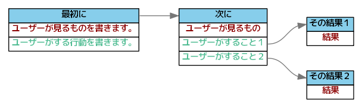
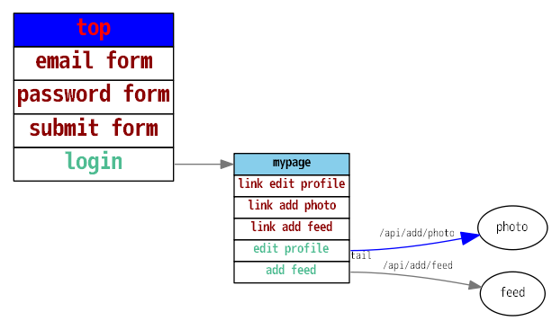

# python-uiflows

hirokidaichi/uiflow に機能を追加したくて、pythonで拡張しました。
入力ファイルも独自のmarkdown形式からYAML形式に変更しています。

## イメージ



```yaml
- name: 最初に
  see:
    - ユーザーが見るものを書きます。
  action:
    - ユーザーがする行動を書きます。
- name: 次に
  see:
    - ユーザーが見るもの
  action:
    - ユーザーがすること１: その結果１
    - ユーザーがすること２: その結果２
- name: その結果１
  see:
    - 結果
- name: その結果２
  see:
    - 結果 
```

## インストール

```bash
python setup.py sdist
pip install dist/python-uiflows-x.x.x.tar.gz
```

## 使い方

```bash
uiflows.exe -i tests/sample2.yml -o tests/sample_test_write_dot_03.png -f png
```

## ちょっと拡張して



```yaml
- name: top
  see:
    - email form
    - password form
    - submit form
  action:
    - login: mypage
  # name, see, action以外の key:value はノードの属性として設定される(Graphvizのパラメータ参照)
  fontcolor: "red"
  fontsize: 20
  # top_bg_color, see_color, action_color はノード内のテーブルの属性値
  top_bg_color: "blue"
- name: mypage
  see:
    - link edit profile
    - link add photo
    - link add feed
  action:
    - event: edit profile
      node: photo
      label: /api/add/photo
      # event, node(option、但しlabel設定時は必須), label(option) 以外の key:value はエッジの属性として設定される(Graphvizのパラメータ参照)
      arrowsize: 1.5
      color: "blue"
      taillabel: "tail"
    - event: add feed
      node: feed
      label: /api/add/feed
```

